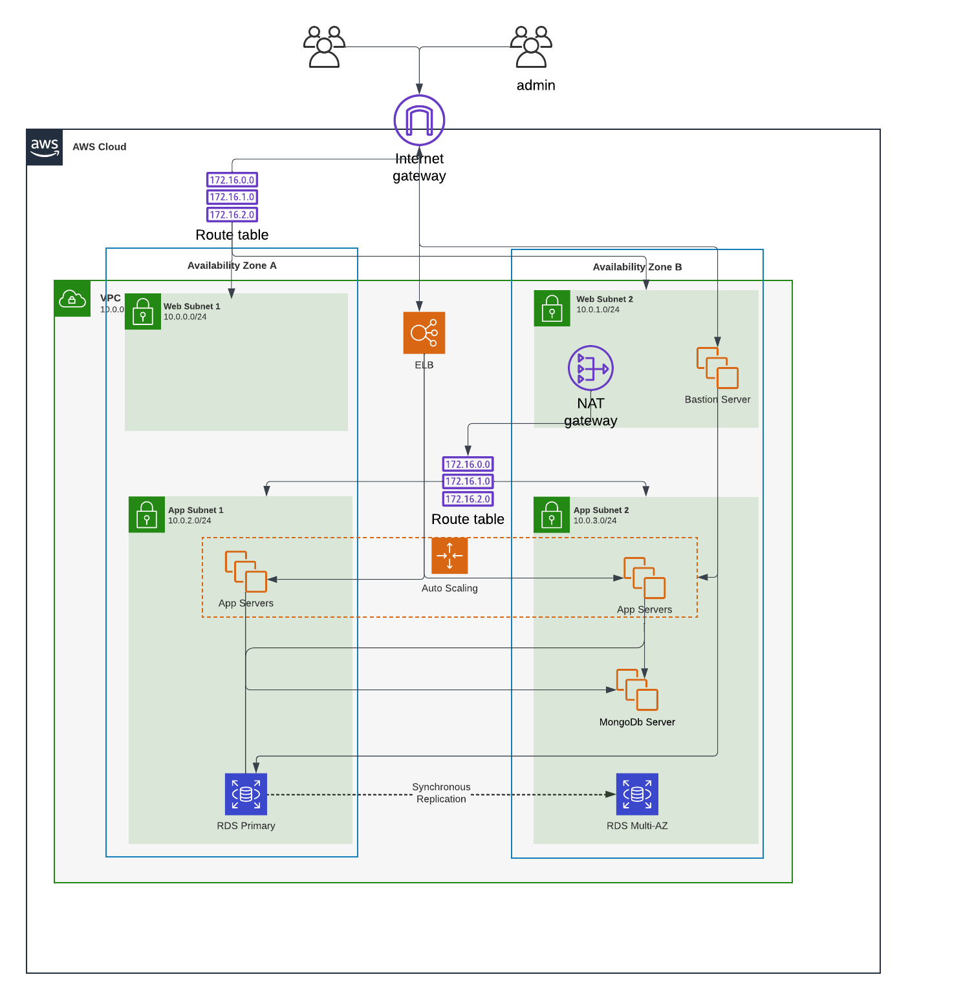

# Terraform AWS Infrastructure

This project sets up a infrastructure on AWS cloud using Terraform. The infrastructure based On production level deployment of Webapp running on Tomcat server and based on Mysql database and MongoDB. 
## Infrastructure Diagram

images/Web-app-Infra.png
images/Web-app-infra.png

## Setup

1. **AWS Credentials**: Configure your AWS credentials on Variable.tf file.
2. **Initialize Terraform**: Run `terraform init` to initialize the project.
3. **Apply Configuration**: Run `terraform apply` to create the infrastructure.

## Tomcat Installation

Tomcat is installed on all application WEB servers using the script in [setup.sh](setup.sh). The script performs the following steps:

1. Updates the package index.
2. Installs Java (Amazon Corretto 11).
3. Downloads and installs Tomcat.
4. Sets environment variables.
5. Starts the Tomcat server.

## Outputs

The following outputs are defined in [variable.tf](variable.tf):

- **AMI Image**: The AMI ID used for the instances.
- **Bastion Server IP**: The public IP of the bastion server.
- **Load Balancer DNS**: The DNS name of the load balancer.